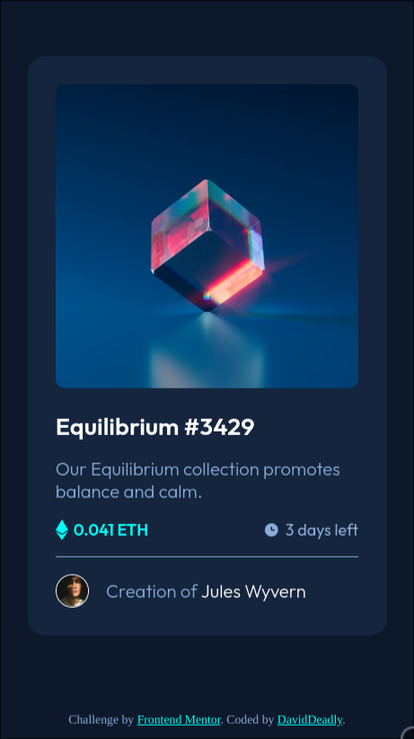
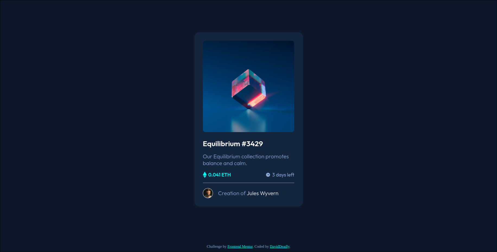

# Frontend Mentor - NFT preview card component solution

This is a solution to the [NFT preview card component challenge on Frontend Mentor](https://www.frontendmentor.io/challenges/nft-preview-card-component-SbdUL_w0U). Frontend Mentor challenges help you improve your coding skills by building realistic projects. 

## Table of contents

- [Overview](#overview)
  - [The challenge](#the-challenge)
  - [Screenshot](#screenshot)
  - [Links](#links)
- [My process](#my-process)
  - [Built with](#built-with)
  - [What I learned](#what-i-learned)
  - [Continued development](#continued-development)
- [Author](#author)

## Overview

### The challenge

Users should be able to:

- View the optimal layout depending on their device's screen size
- See hover states for interactive elements

### Screenshot

### Links

- [Solution URL](https://www.frontendmentor.io/solutions/dav-nft-preview-card-component-do2HLvTUAW)
- [Live Site URL](https://dav-nft-preview-card-component.netlify.app)

## My process

### Built with

- Semantic HTML5 markup
- CSS custom properties
- Flexbox
- CSS Grid
- Mobile-first workflow

### What I learned

I was pretty excited to test the new css nesting feature, so I decided to start get comfortable with it an its differences from other pre-processor nesting. Also once again mobile first was incredible, this time no change was need it for the code to work in both mobiles and desktops.

### Continued development

I tried estimiting how much I would take me to complete the challenge. My initial guess was 1 hours, but I took a little bit more than the double. So it's a future improvement: get better at estimiting my work.

## Author

- Frontend Mentor - [@DavidDeadly](https://www.frontendmentor.io/profile/DavidDeadly)
- X / Twitter - [@DavidD_dly](https://www.twitter.com/DavidD_dly)
