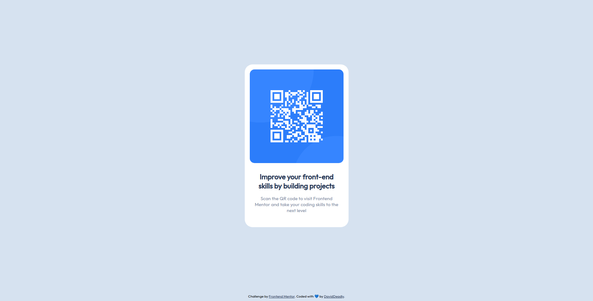

# Frontend Mentor - QR code component solution

This is a solution to the [QR code component challenge on Frontend Mentor](https://www.frontendmentor.io/challenges/qr-code-component-iux_sIO_H). Frontend Mentor challenges help you improve your coding skills by building realistic projects. 

## Table of contents

- [Links](#links)
- [Screenshots](#screenshots)
- [My process](#my-process)
  - [Built with](#built-with)
  - [What I learned](#what-i-learned)
- [Author](#author)

## Links

- Solution URL: [Solution URL ](https://www.frontendmentor.io/solutions/dav-qr-code-component-0CKNibb5YM)
- Live Site URL: [Live website](https://dav-qr-code-component.netlify.app)

## Screenshots

### Mobile view


### Desktop view



## My process

### Built with

- Semantic HTML5 markup
- CSS custom properties
- Mobile-first workflow
- Flexbox

### What I learned

I always heard about the mobile first approach at the moment to bring a responsive web design to live, actually I had never tried before, so this was the perfect opportunity to see if it indeed works or not... And surely did, I didn't use a single media query the style only broke on the higher resolution because the .qr-card had a percentage width so I gave it a fixed value an the design worked in both resolutions, amazing!

Thanks to mobile first approach I only had to switch these code snippets to make the styles work fine in mobile and desktop without any media query:

First width thought on mobile:
```css
.qr-card {
  width: 85%;
}
```
Only fix to make it look good on desktop:
```css
.qr-card {
  width: 330px;
}
```

## Author

- Frontend Mentor - [@DavidDeadly](https://www.frontendmentor.io/profile/DavidDeadly)
- X / Twitter - [@DavidD_dly](https://www.twitter.com/DavidD_dly)
